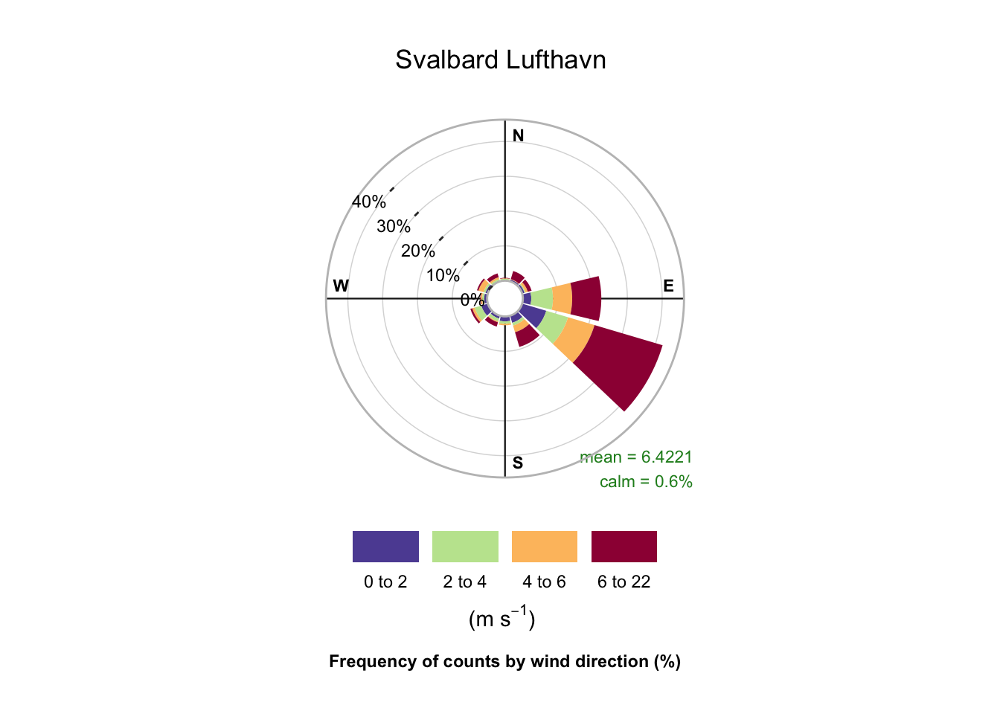
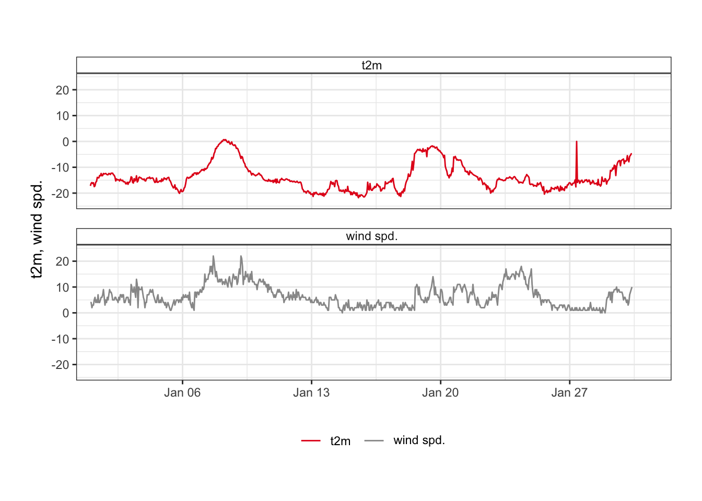
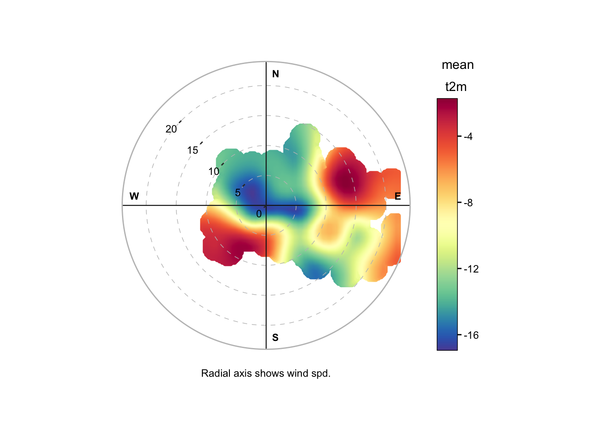
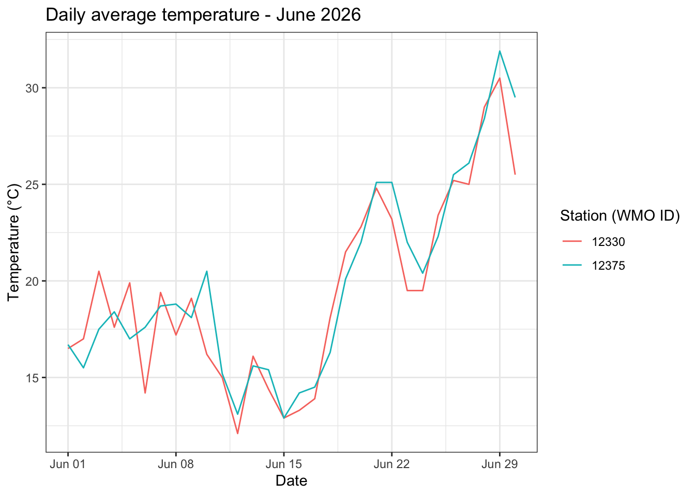
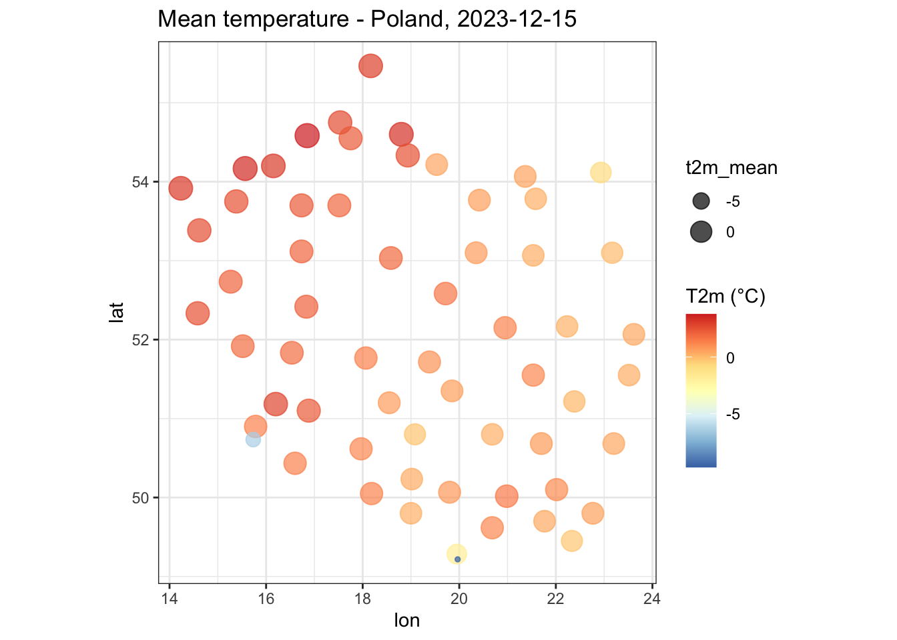

```{r setup, include=FALSE}
knitr::opts_chunk$set(echo = TRUE, eval = FALSE, include = TRUE)
```

Most of meteorological stations working under the umbrella of the World Meteorlogical Organization (WMO) report their observations in the SYNOP format. The **climate** package provides a convenient interface to download and decode SYNOP messages from the [Ogimet](https://www.ogimet.com/) database, which aggregates data from thousands of stations worldwide. Therefore, it is often the most preferable source of meteorological information being a valuable resource for researchers, students, and weather enthusiasts looking to access historical and real-time meteorological data for analysis, visualization, and educational purposes. This information is most often used as a complementary source to national meteorological services that is delivered free of charge and without any API key requirements.

The `meteo_ogimet()` function is the unified entry point for downloading data from [Ogimet](https://www.ogimet.com/).
It uses two backends (automatically) selected by the `interval` argument:

- **`interval = "hourly"`** → **SYNOP backend** (default): downloads and decodes raw SYNOP messages via
  the Ogimet `getsynop` endpoint. Returns clean units used in meteorology (`ws` in m/s, `wd` in degrees, `t2m`
  in °C, POSIXct `date` in UTC).
- **`interval = "daily"`** → **HTML backend** (default): scrapes pre-formatted daily summary tables
  generated in the Ogimet web service.

Use `source = "synop"` or `source = "html"` to override the default for any interval.

---

## 1. Hourly wind patterns over Svalbard (SYNOP backend)

Download a full year of hourly observations and visualize wind patterns and temperature advection
using the [openair](https://davidcarslaw.github.io/openair/) package.

With the SYNOP backend the output already contains:

- `ws` — wind speed in **m/s**
- `wd` — wind direction in **degrees** (no character-to-degrees conversion needed)
- `t2m` — air temperature in °C
- `date` — POSIXct timestamp in UTC (the column name openair expects)

```{r svalbard-download, echo=TRUE}
library(climate)

# Download hourly data for Svalbard Lufthavn (WMO 01008)
df = meteo_ogimet(interval = "hourly",
                  date     = c("2020-01-01", "2020-01-31"),
                  station  = "01008")
head(df[, c("date", "station", "t2m", "ws", "wd")])
```

```
## station: 01008
## http://www.ogimet.com/cgi-bin/getsynop?block=01008&begin=202001010000&end=202001312359
## Downloaded 712 SYNOP messages for: 01008
##                  date station   t2m ws  wd
## 1 2020-01-01 00:00:00   01008 -17.2  4 100
## 2 2020-01-01 01:00:00   01008 -16.2  4 110
## 3 2020-01-01 02:00:00   01008 -15.9  2 100
## 4 2020-01-01 03:00:00   01008 -16.3  3 120
## 5 2020-01-01 04:00:00   01008 -16.0  3 100
## 6 2020-01-01 05:00:00   01008 -17.5  5 100
```

```{r svalbard-windrose, echo=TRUE}
library(openair)

# Wind rose by season — no unit conversion needed
windRose(mydata  = df,
         ws      = "ws",
         wd      = "wd",
         paddle  = FALSE,
         title    = "Svalbard Lufthavn")
```

```{r svalbard-windrose-img, echo=FALSE, eval=TRUE, out.width="100%"}

```

```{r svalbard-timeplot, echo=TRUE}
# Temporal overview of temperature and wind speed
timePlot(df, pollutant = c("t2m", "ws"))
```

```{r svalbard-timeplot-img, echo=FALSE, eval=TRUE, out.width="100%"}

```

```{r svalbard-polar, echo=TRUE}
# Which wind sectors bring warm / cold air masses?
polarPlot(df,
          pollutant     = "t2m",
          x             = "ws",
          wd            = "wd",
          k             = 50,
          force.positive = FALSE,
          resolution    = "fine",
          normalise     = FALSE)
```

```{r svalbard-polar-img, echo=FALSE, eval=TRUE, out.width="100%"}

```

---

## 2. Daily summaries — multi-station temperature comparison

The HTML backend (`interval = "daily"`) returns pre-aggregated daily statistics (Tmax, Tmin, Tavg,
precipitation, etc.) for one or more stations.

```{r daily-download, echo=TRUE}
library(climate)

# Daily summaries for two Polish stations: Poznan (12330) and Warsaw (12375)
daily = meteo_ogimet(interval = "daily",
                     date     = c("2026-06-01", "2026-06-30"),
                     station  = c(12330, 12375))
head(daily)
```

```
## Daily raports will be generated for 6 UTC each day. Use the >>hour<< argument to change it
## station: 12330
## INFO: Please note that the Ogimet has recently limited number of queries that are accepted
##          by the server from a single IP address. Therefore, downloading more than 1 month of data
##          for a single station requires 20 seconds pause between subsequent queries and
##          may take a while. Thank you for your patience.
## station: 12375
##
##          Date     Lon     Lat    Alt Temperature_Max Temperature_Min
##        <Date>  <char>  <char> <char>          <char>          <char>
## 1: 2026-06-30 16.8344 52.4167     88            32.7            18.9
## 2: 2026-06-30 20.9608 52.1628    107              36            20.7
## 3: 2026-06-29 16.8344 52.4167     88            38.9            21.6
## 4: 2026-06-29 20.9608 52.1628    107            38.1            24.7
## 5: 2026-06-28 16.8344 52.4167     88            35.8            21.5
## 6: 2026-06-28 20.9608 52.1628    107            34.7            20.4
##    Temperature_Avg  TdAvg Hr.Avg App.TAvg Wind_Dir. Wind_Int. Wind_Gust
##             <char> <char> <char>   <char>    <char>    <char>    <char>
## 1:            25.5   17.7   64.7     24.8       NNW      16.8      43.2
## 2:            29.5   16.5   49.2     28.3         N      16.7      <NA>
## 3:            30.5   17.7   50.9     30.9         W      11.6      43.2
## 4:            31.9   16.5   41.2     32.8        SW       6.9        36
## 5:              29   15.1   46.8     29.3       SSE         8      <NA>
## 6:            28.4   13.6   42.7     28.4        SE       6.5      <NA>
##    Pres.s.lev Precmm SunD.1 SnowDep TotClOct lowClOct  VisKm station_ID  Prec.
##        <char> <char> <char>  <char>   <char>   <char> <char>     <char> <char>
## 1:     1021.3   <NA>   <NA>    <NA>      5.6      3.3   43.1      12330    0.2
## 2:     1018.6   <NA>   <NA>    <NA>      4.2      0.8   44.4      12375    0.9
## 3:     1016.2   <NA>   <NA>    <NA>      4.6      1.2   32.5      12330    0.0
## 4:     1015.9   <NA>   <NA>    <NA>      2.5      0.7     37      12375    0.0
## 5:     1017.4   <NA>   <NA>    <NA>      2.7      0.2   38.8      12330    0.0
## 6:       1019   <NA>   <NA>    <NA>      1.5        0   37.1      12375    0.0
##    SunD-1
##    <char>
## 1:   10.1
## 2:   14.7
## 3:   13.4
## 4:   15.0
## 5:   15.5
## 6:   15.5
```

```{r daily-plot, echo=TRUE}
library(ggplot2)
daily$Temperature_Avg = as.numeric(daily$Temperature_Avg)

# Compare average temperatures between the two stations
ggplot(daily, aes(x = as.Date(Date), y = Temperature_Avg,
                  colour = factor(station_ID), group = station_ID)) +
  geom_line() +
  labs(title  = "Daily average temperature - June 2026",
       x      = "Date",
       y      = "Temperature (°C)",
       colour = "Station (WMO ID)") +
  theme_bw()
```

```{r daily-plot-img, echo=FALSE, eval=TRUE, out.width="100%"}

```

---

## 3. Country-level bulk download

The SYNOP backend supports downloading all Ogimet stations for an entire country in a single
request via the `country_name` argument. This is useful for spatial analysis.

```{r country-download, echo=TRUE}
library(climate)

# All stations in Poland for a single day
poland = meteo_ogimet(interval      = "hourly",
                      country_name  = "Poland",
                      date          = c("2023-12-15", "2023-12-15"))

cat("Stations:", length(unique(poland$station)), "\n")
cat("Observations:", nrow(poland), "\n")
head(poland[, c("date", "station", "t2m", "ws", "slp")])
```

```
## Downloading country: Poland
## http://www.ogimet.com/cgi-bin/getsynop?begin=202312150000&end=202312152359&state=Poland
## Downloaded 1438 SYNOP messages for: Poland
## Stations: 61
## Observations: 1438
##                  date station t2m ws    slp
## 1 2023-12-15 00:00:00   12001 0.9  8 1022.0
## 2 2023-12-15 06:00:00   12001 2.5 10 1022.3
## 3 2023-12-15 12:00:00   12001 3.6  8 1024.5
## 4 2023-12-15 18:00:00   12001 5.0 14 1025.2
## 5 2023-12-15 00:00:00   12100 1.5  1 1023.8
## 6 2023-12-15 01:00:00   12100 2.1  2 1024.7
```

```{r country-map, echo=TRUE}
# Quick spatial overview — requires coordinates from stations_ogimet()
library(dplyr)

station_meta = stations_ogimet(country = "Poland")

# Join decoded observations with coordinates
poland_geo = poland %>%
  group_by(station) %>%
  summarise(t2m_mean = mean(t2m, na.rm = TRUE), .groups = "drop") %>%
  left_join(station_meta, by = c("station" = "wmo_id"))

ggplot(poland_geo, aes(x = lon, y = lat, colour = t2m_mean, size = t2m_mean)) +
  geom_point(alpha = 0.7) +
  scale_colour_distiller(palette = "RdYlBu", direction = -1, name = "T2m (°C)") +
  coord_quickmap() +
  labs(title = "Mean temperature - Poland, 2023-12-15") +
  theme_bw() +
  theme(legend.position = "right")
```

```{r country-map-img, echo=FALSE, eval=TRUE, out.width="100%"}

```

---

## 4. Full SYNOP output with `return_list`

Setting `return_list = TRUE` returns a named list with two data frames: `$data` (the compact
20-column simplified view) and `$full` (the complete parser output with 30+ columns including
cloud types, precipitation period, snow state, etc.).

```{r return-list, echo=TRUE}
library(climate)

result = meteo_ogimet(interval     = "hourly",
                      station      = 12330,
                      date         = c("2023-06-01", "2023-06-03"),
                      return_list  = TRUE)

# Compact view
names(result$data)

# Full parser output
names(result$full)

# Variables only available in the full output
result$full[1:5, c("low_cloud_type", "middle_cloud_type", "high_cloud_type",
                  "precipitation_time", "snow_depth_state", "source")]
```

```
## station: 12330
## http://www.ogimet.com/cgi-bin/getsynop?block=12330&begin=202306010000&end=202306032359
## Downloaded 72 SYNOP messages for: 12330
##  [1] "date"       "station"    "t2m"        "dpt2m"      "rel_hum"
##  [6] "tmax"       "tmin"       "wd"         "ws"         "gust"
## [11] "press"      "slp"        "press_tend" "precip"     "Nt"
## [16] "Nh"         "N_base"     "insol"      "visibility" "snow"
##  [1] "station_id"           "Date"                 "station_type"
##  [4] "region"               "obs_day"              "obs_hour"
##  [7] "wind_unit"            "wind_estimated"       "visibility"
## [10] "cloud_cover"          "wind_direction"       "wind_speed"
## [13] "air_temperature"      "dewpoint_temperature" "station_pressure"
## [16] "sea_level_pressure"   "pressure_tendency"    "pressure_change"
## [19] "precipitation_amount" "precipitation_time"   "cloud_base_min"
## [22] "cloud_base_max"       "low_cloud_type"       "middle_cloud_type"
## [25] "high_cloud_type"      "low_cloud_amount"     "maximum_temperature"
## [28] "minimum_temperature"  "gust"                 "cloudiness_height"
## [31] "sunshine_duration"    "snow_depth"           "snow_depth_state"
## [34] "source"
##   low_cloud_type middle_cloud_type high_cloud_type precipitation_time
## 1              0                 0               1                 12
## 2              0                 0               1                 NA
## 3              0                 0               1                 NA
## 4              0                 0               4                 NA
## 5              0                 0               1                 NA
##   snow_depth_state
## 1               NA
## 2               NA
## 3               NA
## 4               NA
## 5               NA
##                                                                     source
## 1 AAXX 01001 12330 12982 12101 10119 20060 30074 40182 57008 60001 80001==
## 2       AAXX 01011 12330 42982 22201 10124 20064 30072 40179 58006 80001==
## 3       AAXX 01021 12330 42982 22101 10113 20064 30067 40175 57011 80001==
## 4       AAXX 01031 12330 42981 62601 10101 20059 30066 40174 57008 80004==
## 5       AAXX 01041 12330 42981 50000 10133 20069 30065 40172 56007 80001==
```

---

## 5. Selecting the backend explicitly

Override the automatic backend selection with the `source` argument:

```{r backend-override, echo=TRUE}
library(climate)

# Force HTML backend for hourly data
poznan_html = meteo_ogimet(interval = "hourly",
                           station  = 12330,
                           date     = c("2023-06-01", "2023-06-03"),
                           source   = "html", # or synop
                           precip_split = TRUE)
head(poznan_html)
```

```
## station:  12330
## INFO: Please note that the Ogimet has recently limited number of queries that are accepted
##          by the server from a single IP address. Therefore, downloading more than approx. 1 day of data
##          for a single station requires 20 seconds pause between subsequent queries and
##          may take a while. Thank you for your patience.
##    station_ID     Lon     Lat                Date      T     Td   Tmax   Tmin
##         <num>   <num>   <num>              <POSc> <char> <char> <char> <char>
## 1:      12330 16.8344 52.4167 2023-06-03 06:00:00   10.3    1.9   16.1    5.4
## 2:      12330 16.8344 52.4167 2023-06-03 05:00:00    8.9    2.7   <NA>   <NA>
## 3:      12330 16.8344 52.4167 2023-06-03 04:00:00    7.1    2.6   <NA>   <NA>
## 4:      12330 16.8344 52.4167 2023-06-03 03:00:00    5.7    1.6   <NA>   <NA>
## 5:      12330 16.8344 52.4167 2023-06-03 02:00:00    5.6    1.1   <NA>   <NA>
## 6:      12330 16.8344 52.4167 2023-06-03 01:00:00    6.9      1   <NA>   <NA>
##       ddd  ffkmh Gustkmh  P0hPa P.seahPa   PTnd    Prec     Nt     Nh    HKm
##    <char> <char>  <char> <char>   <char> <char>  <char> <char> <char> <char>
## 1:      E     18    <NA> 1014.9     <NA>    0.5 0.0/12h      0      -   <NA>
## 2:      E   14.4    <NA> 1014.8     <NA>    0.8    <NA>      0      -   <NA>
## 3:    ENE   14.4    <NA> 1014.7     <NA>    1.1    <NA>      0      -   <NA>
## 4:    ENE    7.2    <NA> 1014.4     <NA>      1    <NA>      0      -   <NA>
## 5:    ENE    7.2    <NA>   1014     <NA>      1    <NA>      0      -   <NA>
## 6:      E   14.4    <NA> 1013.6     <NA>    0.9    <NA>      0      -   <NA>
##    InsoD.1  Viskm Snowcm     WW     W1     W2    Hr    Ta Gustmax P seahPa
##     <char> <char> <char> <char> <char> <char> <num> <num>  <char>    <num>
## 1:    <NA>     50   <NA>   <NA>   <NA>   <NA>    56   5.1    <NA>   1025.8
## 2:    <NA>     50   <NA>   <NA>   <NA>   <NA>    65   4.5    <NA>   1025.7
## 3:    <NA>     50   <NA>   <NA>   <NA>   <NA>    73   2.7    <NA>   1025.7
## 4:    <NA>     50   <NA>   <NA>   <NA>   <NA>    75   2.6    <NA>   1025.5
## 5:    <NA>     50   <NA>   <NA>   <NA>   <NA>    73   2.4    <NA>   1025.1
## 6:    <NA>     50   <NA>   <NA>   <NA>   <NA>    66   2.3    <NA>   1024.6
##    InsoD-1   pr6  pr12  pr24
##     <char> <num> <num> <num>
## 1:    10.6    NA     0    NA
## 2:    <NA>    NA    NA    NA
## 3:    <NA>    NA    NA    NA
## 4:    <NA>    NA    NA    NA
## 5:    <NA>    NA    NA    NA
## 6:    <NA>    NA    NA    NA
```
